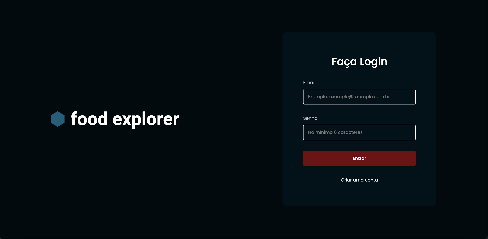
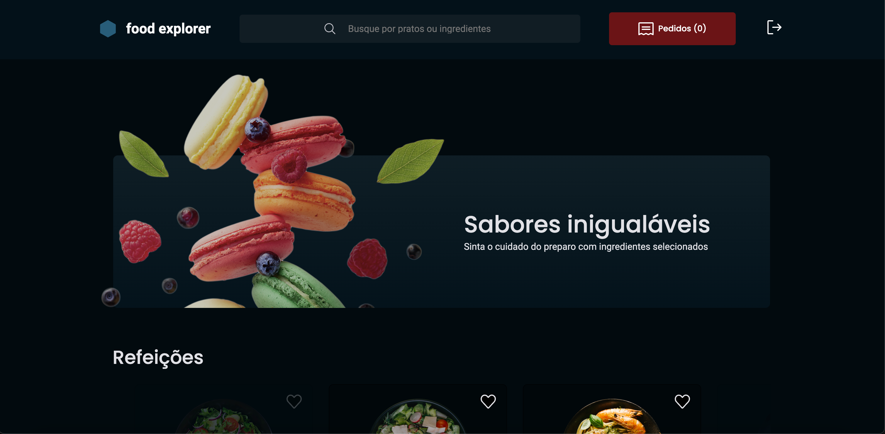

# Food Explorer 🍲

Um site de restaurante interativo onde o administrador e o cliente têm visualizações e funcionalidades diferentes. O administrador pode gerenciar os pratos do menu (adicionar, editar e excluir), enquanto o cliente pode explorar o cardápio, visualizar os detalhes dos pratos e buscar por pratos específicos.

## 📸 Capturas de Tela

## Tela de Login


### Interface do Cliente


### Interface do Administrador


## 🚀 Link para o Site

O site está disponível em [Food Explorer](https://celebrated-otter-1909ab.netlify.app/), hospedado no Netlify com o backend no Render.

## 🛠️ Tecnologias Utilizadas

### Front-End
- **React** - Biblioteca para construção de interfaces de usuário.
- **React Router** - Gerenciamento de rotas.
- **Styled Components** - Estilização dos componentes.
- **Axios** - Requisições HTTP.
- **Vite** - Ferramenta para desenvolvimento rápido.

### Back-End
- **Node.js** e **Express** - Configuração da API REST.
- **Knex** - ORM para manipulação do banco de dados.
- **PostgreSQL** - Banco de dados para armazenar informações dos pratos e dos usuários.
- **JWT (JSON Web Token)** - Autenticação e autorização de usuários.
- **PM2** - Gerenciamento de processos de produção.
- **Multer** - Upload de imagens.
- **Zod** - Validação de dados.

## 📁 Estrutura do Projeto

### Front-End
- **Diretório**: `/web`
- **Scripts**:
  - `npm run dev`: Inicia o servidor de desenvolvimento.
  - `npm run build`: Cria a versão de produção.
  - `npm run preview`: Pré-visualiza a versão de produção.
- **Dependências**:
  - Consulte o `package.json` para uma lista completa de bibliotecas.

### Back-End
- **Diretório**: `/api`
- **Scripts**:
  - `npm run dev`: Inicia o servidor local com a configuração de desenvolvimento.
  - `npm run start:prod`: Inicia o servidor com PM2 em modo produção.
- **Configuração de Banco de Dados**:
  - Arquivo `.env.dev` com variáveis de ambiente para o banco de dados local (PostgreSQL).

## ⚙️ Configuração e Execução Local

### Pré-requisitos
1. **Node.js** e **npm** instalados.
2. **PostgreSQL** instalado e configurado.
3. Arquivo `.env.dev` configurado com as credenciais do seu banco de dados PostgreSQL local.

### Passos para Executar

1. **Clone o repositório**:
   ```bash
   git clone https://github.com/huddmax/food-ex.git
   cd food-ex
   ```

2. **Configurar o Backend**:
   - No diretório `/api`, crie o arquivo `.env.dev` com as seguintes variáveis:
     ```plaintext
     PGHOST=localhost
     PGUSER=seu_usuario
     PGPASSWORD=sua_senha
     PGDATABASE=nome_do_banco
     PGPORT=5432
     JWT_SECRET=sua_chave_secreta
     ```
   - Instale as dependências:
     ```bash
     cd api
     npm install
     ```

3. **Configurar o Frontend**:
   - No diretório `/web`, instale as dependências:
     ```bash
     cd ../web
     npm install
     ```

4. **Executar o Backend**:
   - Inicie o backend:
     ```bash
     npm run dev
     ```

5. **Executar o Frontend**:
   - Inicie o frontend:
     ```bash
     npm run dev
     ```

6. Acesse a aplicação no navegador:
   - **Frontend**: [http://localhost:3000](http://localhost:3000)

## 🔄 Funcionalidades

- **Cliente**:
  - Visualização de pratos disponíveis com descrição e preço.
  - Pesquisa de pratos por nome, descrição ou ingredientes.
  - Navegação pelas categorias de pratos.

- **Administrador**:
  - Adição, edição e exclusão de pratos.
  - Acesso a uma interface específica com ferramentas de gerenciamento.

## 📦 Deploy

- **Frontend**: Hospedado no Netlify ([Link para o site](https://celebrated-otter-1909ab.netlify.app/)).
- **Backend**: Hospedado no Render, com banco de dados PostgreSQL.

## 🚧 Observações e Melhorias Futuras

- Melhorar o tempo de carregamento adicionando transições e animações.
- Otimização da base de dados para resposta mais rápida.